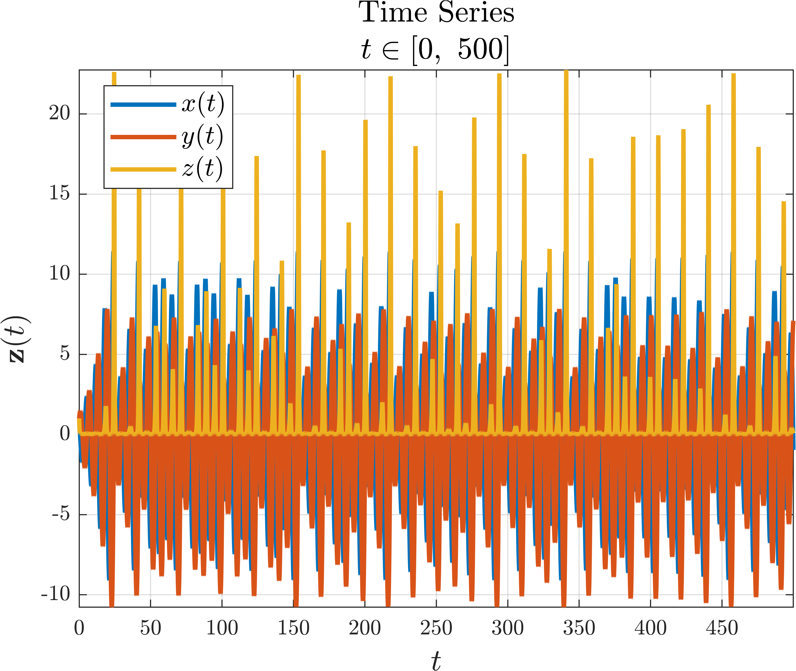
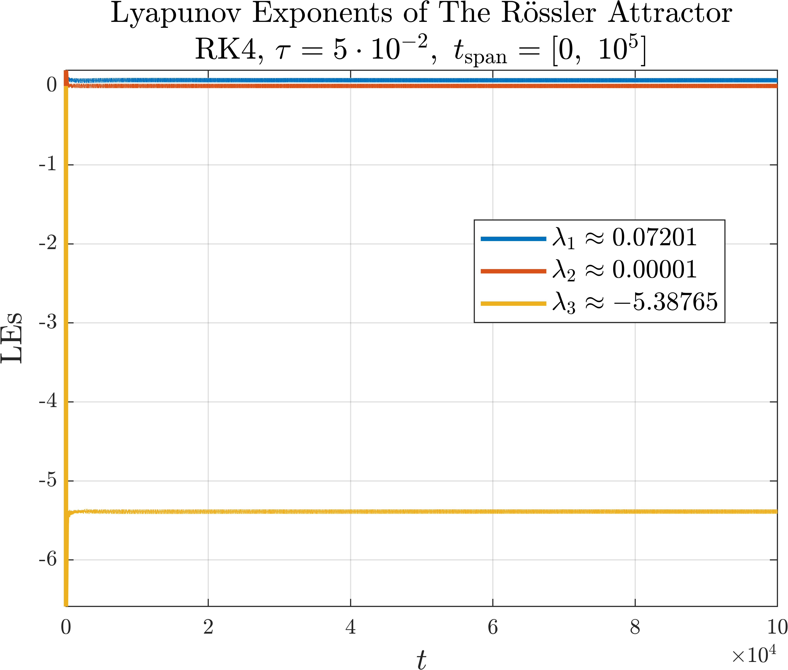

# Lyapunov Exponents
MATLAB script for solving augmented IVP with variational equation, calculating Lyapunov exponents and Kaplan—Yorke dimension.

## Table of Contents
- [Notes on Nonautonomous Systems](#notes-on-nonautonomous-systems)
- [The Variational Equation](#the-variational-equation)
- [The Lyapunov Exponents](#the-lyapunov-exponents)
- [The Kaplan—Yorke Dimension](#the-kaplanyorke-dimension)
- [Example](#example)

## Notes on Nonautonomous Systems
Consider a nonautonomous IVP 

$$ \dot{\mathbf{z}}\left(t\right) = \mathbf{f}\left(t, \mathbf{z}\right), \quad \left.\mathbf{z}\left(t\right)\right|_{t=t_0}=\mathbf{z}_0, $$

where $\mathbf{z} \in \mathbb{R}^m, ~\mathbf{f}: \mathbb{R}\times\mathbb{R}^m \to \mathbb{R}^m$.

In order to compute the Lyapunov exponents, we first need to convert the nonautonomous system to an autonomous system as follows:

$$ z_{m+1} = t,$$

$$\dot{\mathbf{y}}\left(t\right) = \mathbf{g}\left(\mathbf{y}\right), \quad \left.\mathbf{y}\left(t\right)\right|_{t=t_0}=\mathbf{y}_0, $$

where $\mathbf{y} \in \mathbb{R}^{m+1}, ~\mathbf{g}: \mathbb{R}^{m+1} \to \mathbb{R}^{m+1}$:

$$\mathbf{y} = \begin{bmatrix}
			\mathbf{z}\\
			z_{m+1}	
		\end{bmatrix}, \quad  \mathbf{g}\left(\mathbf{y}\right) = \begin{bmatrix}
		\mathbf{f}\left(z_{m+1}	, \mathbf{z}\right)\\
		1
		\end{bmatrix}, \quad \mathbf{y}_0 = \begin{bmatrix}
		\mathbf{z}_0\\
		t_0
		\end{bmatrix}.$$
		
## The Variational Equation

Consider an autonomous IVP 

$$\dot{\mathbf{z}}\left(t\right) = \mathbf{f}\left(\mathbf{z}\right), \quad \left.\mathbf{z}\left(t\right)\right|\_{t=t\_0}=\mathbf{z}\_0, $$

where $\mathbf{z} \in \mathbb{R}^m, ~\mathbf{f}:\mathbb{R}^m \to \mathbb{R}^m$.

For this system the variational equation has the following form:

$$\dot{\boldsymbol{\delta}}\left(t\right) = \mathbf{J}\_\mathbf{f}\left(\mathbf{z}\right) \boldsymbol{\delta}\left(t\right), \quad \left.\boldsymbol{\delta}\left(t\right)\right|\_{t=t_0} = \mathbf{I},$$
	
where $\mathbf{J}_\mathbf{f} \in \mathbb{R}^{m\times m}$ is Jacobian of the function $\mathbf{f}\left(\mathbf{z}\right)$ and $\boldsymbol{\delta} \in \mathbb{R}^{m\times m}$ is variational matrix:
	
$$\mathbf{J}_\mathbf{f}\left(\mathbf{z}\right) = \frac{\text{d}\mathbf{f}}{\text{d}\mathbf{z}} = \begin{bmatrix}
			\boldsymbol{\nabla}^\text{T} f_1 
			\\
			\vdots
			\\
			\boldsymbol{\nabla}^\text{T} f_m
		\end{bmatrix}=
		\begin{bmatrix}
			\dfrac{\partial f_1}{\partial z_1} &\cdots& \dfrac{\partial f_1}{\partial z_m}\\
			\vdots & \ddots & \vdots \\
			\dfrac{\partial f_m}{\partial z_1} &\cdots& \dfrac{\partial f_m}{\partial z_m} 
		\end{bmatrix},$$	

$$\boldsymbol{\delta}\left(t\right) = 
		\begin{bmatrix}
			\delta_{z_1 z_1}\left(t\right)&\cdots& \delta_{z_m z_1}\left(t\right)\\
			\vdots & \ddots & \vdots \\
			\delta_{z_1 z_m}\left(t\right) &\cdots& \delta_{z_m z_m}\left(t\right)
		\end{bmatrix}.$$
		
To find out what happens to the variations, you need to solve the variational equation and the system equation simultaneously. To do this, you work with a new augmented state vector of length $m + m^2$:

$$\mathbf{z}\_\ast = \begin{bmatrix}
			\mathbf{z}\\
			\boldsymbol{\delta}\_{z\_1}\\
			\vdots\\
			\boldsymbol{\delta}\_{z\_m}
		\end{bmatrix},$$
		
where $\forall m$

$$\boldsymbol{\delta}\_{z_m} = \begin{bmatrix}
			\delta_{z_m z_1}\\
			\vdots\\
			\delta_{z_m z_m}
		\end{bmatrix}.$$
		
The augmented IVP is solved using [General Algorithm for the Explicit Runge—Kutta Method](https://github.com/whydenyscry/General-algorithm-of-the-explicit-Runge-Kutta-method). 

To test the algorithm, an example from [here](https://home.cs.colorado.edu/~lizb/chaos/variational-notes.pdf) was used. The results can be seen in the [ExampleOfUse.mlx](ExampleOfUse/ExampleOfUse.pdf) file.

## The Lyapunov Exponents

The calculation of the Lyapunov exponent was based on the QR decomposition method, the application of which can be viewed via the script [odeExplicitGeneralLE.m](Scripts/odeExplicitGeneralLE.m).

### Syntax
`[t, xsol, lyap_exp] = odeExplicitGeneralLE(c_vector, A_matrix, b_vector, ode_fun, jacobian_fun, tspan, tau, incond)`

### Input Arguments
- `c_vector`: vector of coefficients $\mathbf{c}$ of Butcher tableau for the selected method;
- `A_matrix`: matrix of coefficients $\mathbf{A}$ of Butcher tableau for the selected method;
- `b_vector`: vector of coefficients $\mathbf{b}$ of Butcher tableau for the selected method;
- `ode_fun`: function handle that defines the system of ODEs to be integrated;
- `jacobian_fun`: function handle that computes the Jacobian matrix of the system;
- `tspan`: interval of integration, specified as a two-element vector;
- `tau`: time discretization step;
- `incond`: vector of initial conditions.

### Output Arguments
- `t`: vector of evaluation points used to perform the integration;
- `xsol`: matrix in which each row corresponds to a solution at the value returned in the corresponding row of `t`.
- `lyap_exp`: matrix of Lyapunov exponents in which each row corresponds to a Lyapunov exponent at the value returned in the corresponding row of `t`.

## The Kaplan—Yorke Dimension

Let the Lyapunov exponents be sorted in descending order $\lambda \_{1}\geq \lambda \_{2}\geq \dots \geq \lambda \_{m}$, then

$$
D_\text{KY}=k+{\frac {\sum \_{i=1}^{k}\lambda\_{i}}{|\lambda\_{k+1}|}},
$$

where for $k$
$$
\sum \_{i=1}^{k}\lambda \_{i}\geq 0, \quad \sum \_{i=1}^{k + 1}\lambda \_{i}<0.
$$

## Example

The Rössler Attractor in the [ExampleOfUse.mlx](ExampleOfUse/ExampleOfUse.pdf) was chosen as an example:
 
$$ 
\begin{cases}
			\frac{\mathrm{d}x}{\mathrm{d}t} =-y-z,\\
			\frac{\mathrm{d}y}{\mathrm{d}t} = x+\alpha y, \\
			\frac{\mathrm{d}z}{\mathrm{d}t} = \beta+z\left(x-\varsigma\right),
		\end{cases}
$$

$$ 
\begin{bmatrix}
			\alpha\\
			\beta\\
			\varsigma
		\end{bmatrix}=\begin{bmatrix}
		0.2\\
		0.2\\
		5.7
		\end{bmatrix}.
$$

  

  

  

